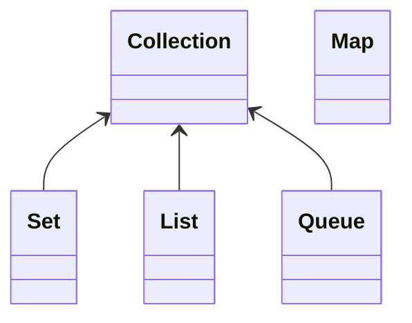

# Chapter 23 컬렉션 프레임워크 1

제네릭을 공부하는 이유 중 하나가 컬렉션 프레임워크를 활용하기 위한 것. 제네릭에 대한 부족한 이해를 완성시켜야 이후 접할 '람다'와 '스트림'에 대한 부담을 줄일 수 있다.

## 23-1 컬렉션 프레임워크의 이해

### 프레임워크란

라이브러리와의 차이점? 프레임워크에는 컬렉션 관련된 클래스의 정의에 적용되는 설계 원칙 또는 구조가 존재한다.

### 컬렉션의 의미와 자료구조

컬렉션 프레임워크는 데이터의 저장방법, 그리고 이와 관련 있는 알고리즘에 대한 프레임워크이다. 

자료구조, 알고리즘을 몰라도 이미 구현해놓은 결과물 사용 가능해짐

### 컬렉션 프레임워크의 기본 골격



( 뒤에 `<E>` 생략됨. Mermaid 처음 보는데 이스케이프가 안 먹힌다)

위 그림은 지금부터 소개할 컬렉션 클래스들이 구현하는 인터페이스들의 상속 관계를 보여준다.

## 23-2 `List<E>`

`List<E>` 인터페이스를 구현하는 대표적인 컬렉션 클래스 둘은 다음과 같다.

* `ArrayList<E>` 배열 기반 자료구조
* `LinkedList<E>` 리스트 기반 자료구조

공통점

* 인스턴스의 저장 순서를 유지한다.
* 동일한 인스턴스의 중복 저장을 허용한다.

### `ArrayList<E>` 클래스

```java
List<String> list = new ArrayList<>();
```

주로 `List<E>`에 선언된 메소드를 호출하기 때문에 굳이 어레이리스트형 참조변수를 선언할 필요가 없고, 이렇게 하면 이후 list를 링크드리스트로 교체하기 용이해진다.

```java
for(int i = 0; i < list.size(); i++)
    System.out.print(list.get(i) + '\t');
```

리스트 순회 방식은 위와 같다.

### `LinkedList<E>` 클래스

`new LinkedList<E>`

연결 리스트 기반

### 리스트 간 비교

* 어레이리스트의 장단점
  * 저장된 인스턴스의 참조가 빠름
  * 저장 공간 늘리는 과정에서 시간 소요
  * 인스턴스의 삭제 과정에서 연산 많이 필요 (느림)

* 링크드 리스트의 장단점
  * 저장된 인스턴스의 참조 느림
  * 저장 공간 늘리는 과정 간단
  * 인스턴스의 삭제 과정 단순

### 리스트 순회(1): enhanced for문

```java
for(String s : list)
    System.out.print(s + '\t');
```

### 리스트 순회(2): Iterator

```java
Iterator<String> itr = list.iterator();
// 이터레이터 처음 획득

while(itr.hasNext()) {
    System.out.print(itr.next() + '\t');
}
```

위의 for-each 문을 이용한 순차적 접근과 달리, 반복자를 이용하면 <u>반복 중간에 특정 인스턴스를 삭제하는 것이 가능하다.</u> 

```java
while(itr.hasNext()) {
    Str = itr.next();
    if(str.equals("Box"))
        itr.remove;
}
```

순회하면서 저장된 문자열 중 Box를 모두 지울 수 있다.

반복자의 위치를 되돌리는 방법? 없고요... 반복자를 다시 얻으면 된다.

**이터레이터가 할 수 있는 것들**

* `E next()` 다음 인스턴스의 참조 값을 반환
* `boolean hasNext()` next 메소드 호출 시 참조 값 반환 가능 여부 확인
* `void remove()` next 메소드 호출을 통해 반환했던 인스턴스 삭제

> 앞서 소개한 for-each 문도 컴파일 과정에서 이터레이터를 사용하는 코드로 수정된다.

### 배열과 컬렉션 인스턴스 간 변환

배열과 ``ArrayList<E>``는 특성이 유사한데, 대부분의 경우 후자가 더 좋다.

* 인스턴스의 저장과 삭제가 편함
* 이터레이터 사용 가능.

그러나 선언과 동시에 초기화가 안 되는 점이 번거롭다.

```java
List<String> list = Arrays.asList("Toy", "Robot", "Box");
```

근데 이건 변경이 불가능함. 따라서 인스턴스 추가, 삭제 필요하다면 다음과 같이.

```java
class ArrayList<E> {
    public ArrayList(Collection<? extends E> c) {...}  // 생성자
    ...
}
```

생성자의 의미

* `Collection<E>`를 구현한 컬렉션 인스턴스를 인자로 전달받는다.
* 그리고 E는 인스턴스 생성 과정에서 결정되므로 무엇이든 될 수 있다.
* (와일드카드 추가) 덧붙여, 매개변수 c로 전달된 컬렉션 인스턴스에서는 참조만(꺼내기만) 가능하다.

위 코드 활용 예시

```java
class AsListCollection {
    public static void main(String[] args) {
        List<String> list = Arrays.asList("Toy", "Box", "Robot", "Box");
        list = newArrayList<>(list);
        
        // 이렇게 해서 list를 배열에서 추가, 삭제가능한 어레이리스트로 변경하였습니다.
    }
}
```

**컬렉션 인스턴스 간 변환**

대다수 컬렉션 클래스들은 다른 컬렉션 인스턴스를 인자로 전달받는 생성자를 가지고 있다. 예를 들어 ArrayList(), LinkedList(), HashSet() 과 같은 경우 인자로 다른 컬렉션 인스턴스를 넣어주면 구조가 바뀐 새 인스턴스가 등장.

```java
list = new LinkedList<>(list);
```

위 예제에 덧붙여, 원래 어레이리스트였던 list를 링크드리스트로 바꾸어 반환 할 수 있다. 

### 기본 자료형 데이터의 저장과 참고

컬렉션 인스턴스도 기본 자료형의 값은 저장하지 못한다. 그러나 오토 박싱과 오토 언박싱으로, 래퍼 클래스를 이용하여 자연스럽게 코드 구성이 가능하다.

### 연결 리스트만 갖는 양방향 반복자

어레이리스트와 링크드리스트의 경우 반복자가 양방향 이동이 가능하다. 이것은 ListIterator 라는 (`Iterator<E>`를 상속하는) 새 종류의 반복자를 이용해 가능하다.

* `E Next()` 다음 인스턴스의 참조 값을 반환
* hasNext()
* remove (리턴은  void)
* `E Previous()` 이전 인스턴스의 참조 값을 반환
* hasPrevious()
* add(), set()

다음과 같이 사용한다.

* next 호출 후 add 하면 뒤에 삽입
* previous 호출 후 add 하면 앞에 삽입


## 23-3 `Set<E>`

### `Set<E>` 인터페이스, `HashSet<E>` 클래스

`Set<E>` 인터페이스를 구현하는 제네릭 클래스의 특징

* 저장 순서 x
* 데이터의 중복 저장 x

set은 집합이니까요... set이를 구현하는 대표 클래스가 hashset

### 해쉬 알고리즘과 hashCode 메소드

해쉬테이블 네네

`HashSet<E>` 클래스의 탐색 과정

1. Object 클래스에 정의된 hashCode 메소드의 반환 값을 기반으로 부류 결정
2. 선택된 부류 내에서 equals 메소드를 호출하여 동등 비교

### hashCode 메소드의 다양한 정의

다양하게 정의할 수 있지만 항상 생각해내기엔 번거롭다. 특별한 경우가 아니라면 이렇게 사용

```java
@Override
public int hashCode() {
    return Objects.hash(model, color);
}
// 전달 인자 model, color 기반 해쉬 값 반환
```

### `TreeSet<E>` 클래스의 이해와 활용

`Set<E>` 인터페이스를 구현하는 클래스이다. 트리 자료구조 기반으로 인스턴스를 저장한다. 이는 정렬된 상태가 유지되면서 인스턴스가 저장됨을 의미한다. (트리 특.)

정렬의 기준은 디폴트가 오름차순이다. 그런데 String 같은 경우엔 어떻게 하지? 인터페이스를 구현하여 정렬 기준을 세우자.

### 인스턴스의 비교 기준을 정의하는 `Comparable<T>`

`Comparable<T>` 인터페이스의 유일한 추상 메소드는 `int compareTo(T o)` 이다.

이 메소드의 정의 방법은 다음과 같다.

* 인자로 전달된 o가 작다면 양의 정수 반환

* o가 크다면 음의 정수 반환

* o와 같다면 0 반환.

예를 들어 `my.compareTo(your);` 이렇게 호출한다.

위 추상 메소드를 구현하여 정렬의 기준을 정한다. 예를 들어서 나이가 어린 사람부터 많은 사람 순으로 정렬하고 싶은 경우가 있다.

```java
@Override
public int compareTo(Person p) {
    return this.age - p.age;
}
```

만약에 나이가 많은 사람이 앞에 오도록 하고 싶다면 this와 p의 위치를 바꾼다.

### `Comparator<T>` 인터페이스를 기반으로 `TreeSet<E>`의 정렬 기준 제시

일시적인 기준 변경이라면 메소드를 수정하는 일은 적절치 않다. 이러한 상황을 고려하여 컴퍼레이터가 있다.

`public interface Comparator<T>`

이 인터페이스의 메소드 `int compare(T o1, T o2)`의 구현을 통해 정렬 기준을 결정할 수 있다.

이 인터페이스를 구현한 클래스의 인스턴스는 `TreeSet<E>`의 생성자를 통해 전달할 수 있다. 전달 받아 생성된 인스턴스는, 전달된 기준 (compare 메소드 구현) 에 따라서 정렬을 진행한다.

`int compare(T o1, T o2)`의 정의 기준은 다음과 같다.

* `o1 > o2` 양의 정수 반환
* `o1 < o2` 음의 정수 반환
* `o1 == o2` 0 반환

책 p.579 예제 코드

자바에서 제공하는 기본 클래스(예: String)를 대상으로 정렬 기준을 바꿔야하는 상황에서 Comparator의 구현이 좋은 해결책이 된다.

### 중복된 인스턴스 삭제

List에서 Set으로 변환하였다가 다시 List로 변환하면 된다.

## 23-4 `Queue<E>`

### 스택과 큐의 이해

스택 LIFO 후입선출

큐 FIFO 선입선출

### `Queue<E>` 인터페이스

대표적 메소드

* boolean add(E e)
* E remove()
* E element() 확인하기

근데 위 세가지 메소드의 경우 공간이 다 찼거나, 지울 것이 없는 경우에는 예외를 발생시킨다. 따라서 아래를 일반적으로 사용.

* `Boolean offer(E e)` 넣기. 넣을 공간 부족하면 false 반환
* `E pool()` 꺼내기. 꺼낼 대상 없으면 null 반환
* `E peek()` 확인하기. 확인 대상 없으면 null 반환.

`LinkedList<E>`는 `List<E>`를 구현하면서 동시에 `Queue<E>`를 구현하는 컬렉션 클래스이다. 따라서 어떠한 타입의 참조변수로 참조하느냐에 따라서 리스트로도 동작하고 큐로도 동작한다.

### 스택의 구현

`Stack<E>`를 통해 지원하고 있다. 그러나, 이것은 동기화된 클래스로, 멀티 쓰레드에 안전하지만 성능의 저하가 발생한다. 따라서 이것 대신 덱(Eque)이라는 자료구조를 사용한다.

`pulbic interface Deque<E> extends Queue<E>`

덱은 양방향에서 넣고 꺼내는 것이 모두 가능하다. 따라서 덱은 스택처럼, 큐처럼 사용할 수 있다.

덱에도 대표 메소드가 있다. 위의 큐의 대표 메소드와 같은 문제 (예외) 때문에 다음 메소드들을 사용한다.

* 앞에서
  * `boolean offerFirst(E e)`
  * `E pollFirst()`
  * `E peekFirst()`
* 뒤로
  * `boolean offerLast(E e)`
  * `E pollLast()`
  * `E peekLast()`

따라서 스택이 필요하면 덱을 대상으로 다음 메소드만 사용한다.

* 앞으로 넣고 앞에서 꺼내기 만 사용
* 뒤로 넣고 뒤에서 꺼내기 만 사용

앞이나 뒤 중 한 쪽에서만 넣고 꺼내면 된다.

앞서 보았던 `LinkedList<E>`는 `Deque<E>` 인터페이스를 구현하기도 한다.

따라서 어느 타입의 참조변수로 참조하느냐에 따라서 링크드리스트의 성격이 결정된다. (덱, 리스트, 큐)

덱을 스택으로 사용하는 경우 메소드 호출 시 실수가 발생할 수 있다. 따라서 스택이 필요한 경우 다음과 같이 별도의 클래스를 정의하여 사용할 것을 권한다.

(저자가 정의한 클래스, 책 p589)

## 23-5 `Map<K, V>`

키, 밸류가 한 쌍인 데이터 구조!!

### Key-Value 방식의 데이터 저장과 `HashMap<K, V>` 클래스

Key는 중복 불가. Value는 상관없음

맵케이브이를 구현하는 대표 클래스로 `HashMap<K, V>`와 `TreeMap<K, V>`가 있다. 둘의 가장 큰 차이점은, 트리맵은 트리 자료구조 기반이라서 정렬 상태 유지한다는 점. (정렬 기준은 Key)

### `HashMap<K, V> 순회`

이터레이터 인터페이스가 구현이 안 되어있으니 for-each문이나 이터레이터로 순회 불가. 대신 다음 메소드 사용

`public Set<K> keySet()`

```java
import java.util.HashMap;
import java.util.Iterator;
import java.util.Set;

class HashMapIteration {
    public static void main(String[] args) {
        HashMap<Integer, String> map = new HashMap<>();
        
        // Key-Value 기반 데이터 저장
        map.put(45, "Brown");
        map.put(37, "James");
        map.put(23, "Martin");

        // Key만 담고 있는 컬렉션 인스턴스 생성
        Set<Integer> ks = map.keySet();

        // 전체 Key 출력 (for-each문 기반)
        for(Integer n : ks)
            System.out.print(n.toString() + '\t');
        System.out.println();

        // 전체 Value 출력 (for-each문 기반)
        for(Integer n : ks)
            System.out.print(map.get(n).toString() + '\t');
        System.out.println();

        // 전체 Value 출력 (반복자 기반)
        for(Iterator<Integer> itr = ks.iterator(); itr.hasNext(); )
            System.out.print(map.get(itr.next()) + '\t');
        System.out.println();
    }
}
```

### `TreeMap<K, V>`의 순차적 접근 방법

위의 예제에서 HashMap를 TreeMap으로 변경하면, 정렬된 채로 키값의 오름차순으로 출력된다.

접근 순서를 다르게 하려면 `Comparator<T>` 인터페이스의 `compate(o1, o2)`를 수정한다.

